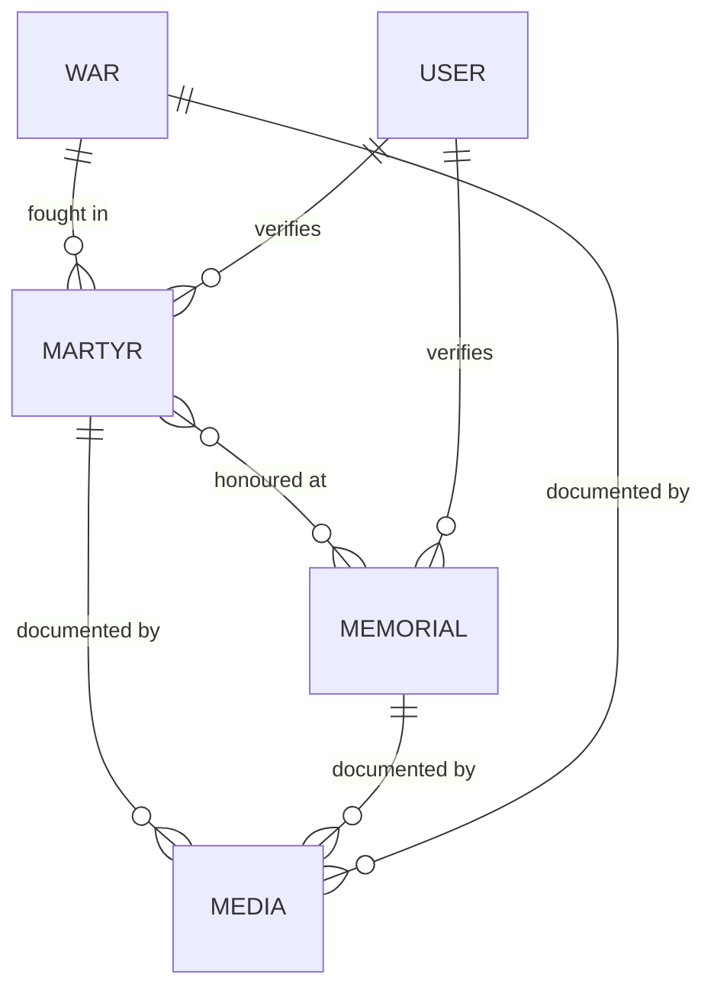

# Veergatha — Data Model

MongoDB / Mongoose. Five collections: `War`, `Martyr`, `Memorial`, `Media`, `User`.
Implemented in [`server/src/models/`](../server/src/models/); verified offline by
`npm run check:models` (21 cases).

## Entity relationships



### The relationship decisions that matter

**`Martyr` ↔ `Memorial` is many-to-many.** A Kargil recipient is typically named at the
National War Memorial *and* a state memorial *and* a regimental one. A single `memorialId`
cannot express that and forces a painful migration later.

Implemented as an indexed `memorials: [ObjectId]` **on the Martyr side only** — one source
of truth, no two-way sync. The reverse lookup is a single indexed query:

```js
Martyr.find({ memorials: memorialId })
```

That direction is forced by cardinality: a recipient is named on 1–3 memorials, but the
National War Memorial alone carries ~26,000 names. An array on the memorial would be an
unbounded document.

**`War` → `Martyr` is one-to-many**, referenced from the martyr. `operation` is a free-text
sub-phase within the conflict ("Operation Vijay", "Op Meghdoot").

**`Media` is referenced, never embedded.** The gallery queries media directly, and one
photograph can document both a person and the memorial naming them.

**`sources` and `awards` are embedded** — bounded, and never wanted without their parent.

---

## Collections

### `War`

| Field | Type | Notes |
|---|---|---|
| `slug` | String | unique, indexed, lowercase-hyphenated |
| `name` | String | required |
| `type` | Enum | `war` \| `operation` \| `counter-insurgency` \| `peacekeeping` |
| `startDate` / `endDate` | Date | `endDate` null while ongoing |
| `summary` | String | ≤400 chars, for cards |
| `description` | String | long form |
| `heroImage` | ObjectId → Media | |
| `sources` | \[Source\] | embedded |
| `verification` | Verification | embedded |

Validates that `endDate` is not before `startDate`.

### `Memorial`

| Field | Type | Notes |
|---|---|---|
| `slug` | String | unique, indexed |
| `name` | String | required |
| `location.city` / `.district` / `.state` | String | `state` indexed |
| `location.coordinates` | GeoJSON Point | `{ type: "Point", coordinates: [lng, lat] }` |
| `inauguratedYear` | Number | 1800–2100 |
| `managedBy` | String | ASI / state trust / regiment / MoD |
| `description` | String | |
| `heroImage`, `gallery` | ObjectId → Media | |
| `sources`, `verification` | embedded | |

> **GeoJSON, not two loose floats.** A real Point with a `2dsphere` index gives `$near` and
> `$geoWithin` for free — that is what `/api/memorials/near` uses. `coordinates` defaults to
> `undefined` rather than `[]`, because a 2dsphere index tolerates an absent field but
> rejects an empty array.

### `Martyr`

| Field | Type | Notes |
|---|---|---|
| `slug` | String | unique, indexed |
| `fullName` | String | required |
| `rank`, `serviceNumber`, `unit` | String | |
| `serviceBranch` | Enum | Army \| Navy \| Air Force \| BSF \| CRPF \| Assam Rifles \| ITBP \| Other |
| `regiment` | String | indexed — a search facet |
| `dateOfBirth` | Date | |
| `status` | Enum | `fell-in-action` \| `survived` — see below |
| `dateOfMartyrdom` | Date | indexed. **Required only when `status: 'fell-in-action'`** |
| `placeOfBirth.village/.district/.state` | String | `state` indexed |
| `war` | ObjectId → War | indexed |
| `operation` | String | |
| `memorials` | \[ObjectId → Memorial\] | indexed, many-to-many |
| `awards` | \[Award\] | embedded; some hold more than one |
| `biography` | String | |
| `portrait`, `gallery` | ObjectId → Media | |
| `sources`, `verification` | embedded | |

> **Not every gallantry recipient died.** Of the 21 Param Vir Chakra recipients, three were
> decorated for actions they survived — Bana Singh, Yogendra Singh Yadav and Sanjay Kumar.
> A schema requiring `dateOfMartyrdom` cannot represent them, and UI copy calling every
> record a "martyr" would describe living people as dead. The model rejects a
> `dateOfMartyrdom` *and* a posthumous award on a `survived` record.

**`Award` (embedded)**

```js
{
  name: String,        // 'Param Vir Chakra' | 'Maha Vir Chakra' | 'Vir Chakra'
                       // | 'Ashoka Chakra' | 'Kirti Chakra' | 'Shaurya Chakra'
                       // | 'Sena Medal' | 'Mention in Despatches' | 'Other'
  year: Number,
  posthumous: Boolean,
  citation: String,    // verbatim gazette text — never paraphrased
  gazetteRef: String   // 'Gazette of India, 15 Aug 1999, No. 42-Pres/99'
}
```

### `Media`

| Field | Type | Notes |
|---|---|---|
| `kind` | Enum | `photo` \| `document` \| `video` |
| `title`, `description` | String | |
| `cloudinary.publicId` | String | required — the delete/transform handle |
| `cloudinary.secureUrl` | String | required |
| `cloudinary.width/.height/.format/.bytes` | | store what the upload API returns |
| `credit` | String | required for attribution licences |
| `license` | Enum | `GODL-India` \| `CC-BY` \| `CC-BY-SA` \| `public-domain` \| `permission-granted` \| `unverified` |
| `sourceUrl` | String | |
| `linkedTo.martyr/.memorial/.war` | ObjectId | sparse indexes |
| `verification` | embedded | |

> `license` defaults to `unverified`, and a record cannot be verified while it holds that
> value. Making the permissive state the one you opt into is what stops an uncleared image
> reaching production.

### `User`

| Field | Type | Notes |
|---|---|---|
| `email` | String | unique, lowercased |
| `name` | String | required |
| `role` | Enum | `admin` \| `editor` |
| `passwordHash` | String | bcrypt cost 12, `select: false` |
| `tokenVersion` | Number | `select: false`; bump to revoke refresh tokens |
| `failedLoginAttempts` / `lockedUntil` | | `select: false`; 5 attempts → 15-minute lockout |
| `lastLoginAt` | Date | |

Assign plaintext to the `password` virtual and it is hashed in a `pre('validate')` hook —
**not** `pre('save')`, because Mongoose validates before user save hooks run, so a
`required` passwordHash would reject every new user.

---

## Shared embedded shapes

**`Source`** — provenance lives inside the record, not in a separate sheet that drifts.

```js
{
  field: String,      // which claim this backs: 'dateOfMartyrdom', 'awards.citation'
  title: String,
  publisher: String,  // 'Gallantry Awards Portal, Ministry of Defence'
  url: String,
  accessedAt: Date,
  tier: String        // 'primary' | 'secondary'
}
```

Per-field attribution is the difference between "we cited sources" and being able to answer
*"where did this date of birth come from?"*

**`Verification`**

```js
{ status: 'draft' | 'in-review' | 'verified', verifiedBy, verifiedAt, notes }
```

Public endpoints filter on `verified`. Three states, not a boolean — "written but unchecked"
and "checked and published" are genuinely different.

A record cannot reach `verified` without at least one `tier: 'primary'` source. That rule is
enforced in the schema, so no route, seed script or admin form can bypass it.

---

## Indexes

| Collection | Index | Serves |
|---|---|---|
| all | `{ slug: 1 }` unique | detail routes |
| Martyr | text on `fullName`, `regiment`, `operation`, `biography` | `/api/search` |
| Martyr | `{ war: 1, 'verification.status': 1 }` | conflict detail |
| Martyr | `{ 'placeOfBirth.state': 1 }` | state facet |
| Martyr | `{ dateOfMartyrdom: -1 }` | year facet |
| Martyr | `{ memorials: 1 }` | reverse of the M:N |
| Martyr | `{ 'awards.name': 1 }` | award facet |
| Memorial | `{ 'location.coordinates': '2dsphere' }` | `/api/memorials/near` |
| Media | `{ 'linkedTo.*': 1 }` sparse | profile gallery |
| User | `{ email: 1 }` unique | login |

The text index is weighted `fullName` 10, `regiment` 5, `operation` 3, `biography` 1.
MongoDB allows **one text index per collection**, so every searchable martyr field must live
in that single compound index.

---

## Deliberately out of the model

- **No denormalised counts.** A drifting counter is worse than `countDocuments()` at this scale.
- **No sessions collection.** Short access token + refresh token, with `tokenVersion` as the revocation lever.
- **No soft-delete flag.** `verification.status: 'draft'` already means "not public".
